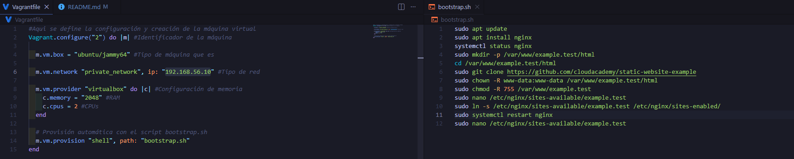
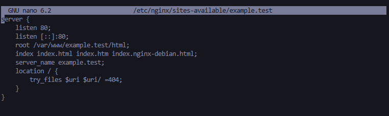
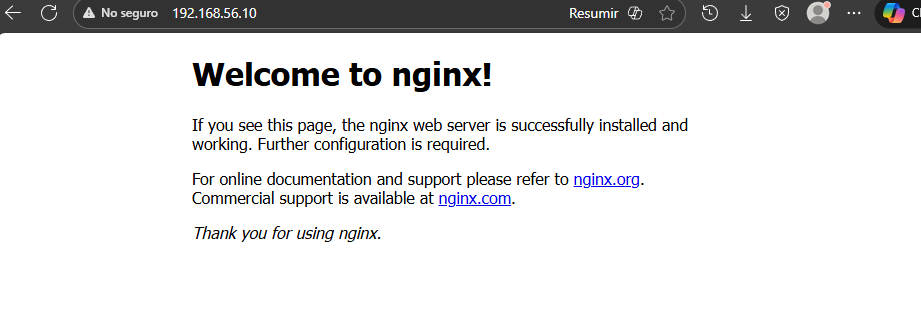
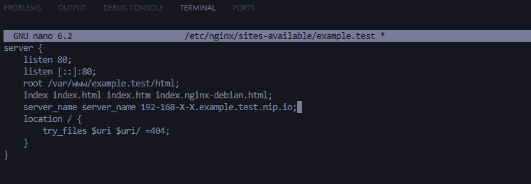
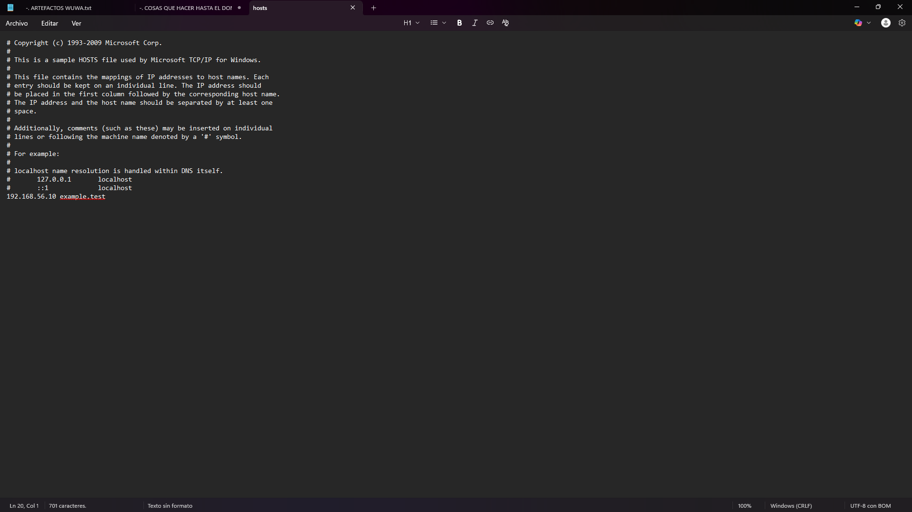
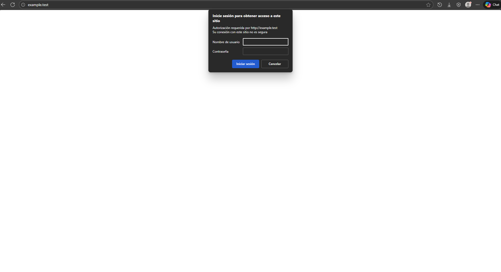
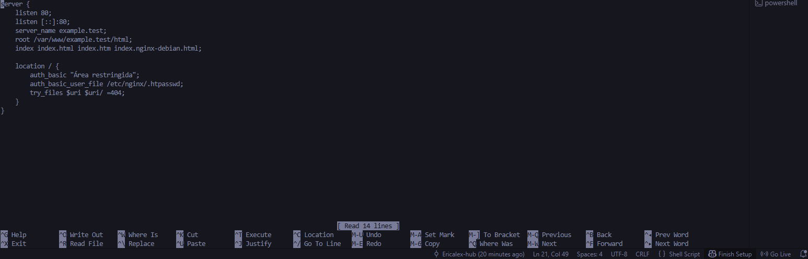
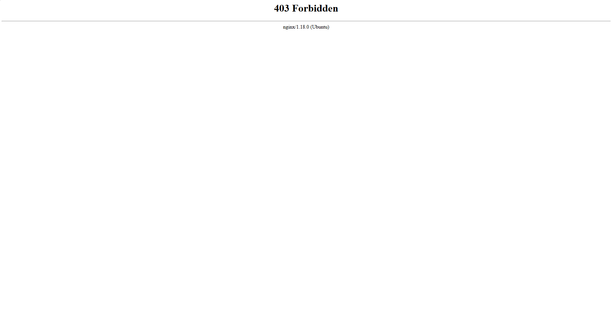

# Práctica DAW: Despliegue de un Servidor Web con Vagrant y Nginx

## 1. Objetivo y planteamiento

Monté una máquina virtual con Vagrant, instalé Nginx automáticamente y probé que sirviera una web estática accesible desde mi navegador a través de un dominio local.

## 2. Preparativos y estructura básica

- **Vagrantfile**: define y levanta la VM con Ubuntu.
- **bootstrap.sh**: instala y configura todo dentro de la VM sin que yo tenga que ir comando a comando.
- Todo el proyecto está dentro de una carpeta local de mi PC.

## 3. Configuración de la máquina virtual

La VM la hice con la box de Ubuntu. Le puse una IP privada tipo `192.168.56.10` y le asigné 2GB de RAM y 2 CPUs para que vaya fluida en las pruebas.

## 4. Instalación y configuración automática

Con el provisionado de Vagrant, todo lo de instalar Nginx, crear carpetas web y configurar el sitio va en el script, así tarda menos y me aseguro que siempre va igual.

## 5. Ajuste del archivo hosts

Para acceder por nombre (ej. page.local), edité el archivo `hosts` de mi máquina para apuntar el nombre al IP privado que le puse a la VM.

- Windows: `C:\Windows\System32\drivers\etc\hosts`
- Linux/Mac: `/etc/hosts`

# Práctica DAW: Despliegue de un servidor web con Vagrant y Nginx 2

## 1. Objetivo y planteamiento

He echo que la web pida usuario y contraseña antes de dejar entrar a cualquiera, pidiendo credenciales y, si no se pone bien, no se puede ver la página. Así, solo los usuarios registrados pueden acceder a esta página

## 2. Preparando usuarios para Nginx

Primero creé un archivo donde van los usuarios y las contraseñas cifradas. Añadí dos usuarios, uno con mi nombre y otro con mi primer apellido junto con una contraseña para cada uno. Luego revisé que estuvieran bien guardadas con el cat.

## 3. Cómo dejé mi Nginx

Acontinuación fui al archivo donde se configura mi página y le puse el aviso de zona restringida. También le dije al servidor dónde tiene que mirar los usuarios válidos. Así, cualquier ruta pide la autenticación antes de cargar la web.

## 4. Activando la autenticación y probando

Activé la config en Nginx, recargué para que cogiera los cambios y probé desde el navegador. Ahora siempre me pide el usuario y la clave. Al ponerlo bien, me deja entrar, y si lo fallo, o cancelo, no puedo ver la web. Puse capturas del funcionamiento.

Cancelar registro:

Registro equivocado:

Registro correcto y vista de página:
